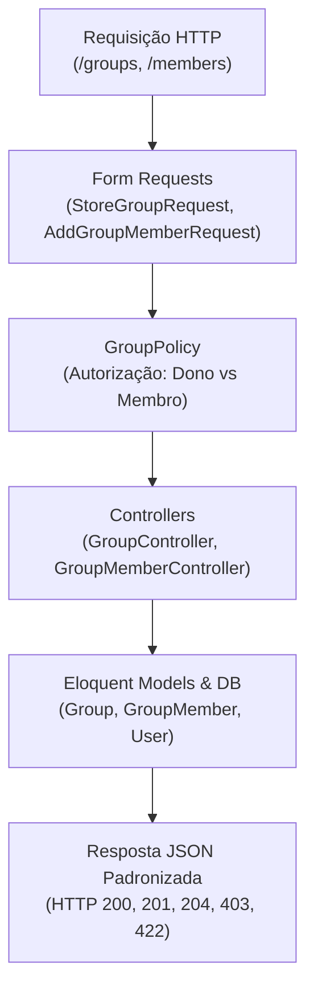

# 📋 Plano de Implementação — Track 1: Gestão de Grupos e Participantes (Artel)

**Desenvolvedor(a):** Pessoa 1  
**Branch:** `feature/group-management`  
**Escopo:** Backend essencial (Models, FormRequests, Controllers, Policies e Rotas REST)  
**Status dos Testes:** Postergados para a próxima fase conforme alinhamento.

---

## 🎯 Objetivo
Entregar o módulo completo de **Grupos e Participantes** de forma limpa, profissional e desacoplada, permitindo que usuários criem grupos (ex: viagens, churrascos, restaurantes), convidem amigos e gerenciem permissões com segurança.

---

## 🧱 Arquitetura e Camadas

---

## 📁 Detalhamento dos Arquivos a Serem Criados/Modificados

### 1. Camada de Validação (`app/Http/Requests`)
Separar a validação do controller garante código limpo e reutilizável.

* **`app/Http/Requests/StoreGroupRequest.php`**
  * `name`: obrigatório, string, mínimo 3, máximo 255 caracteres.
* **`app/Http/Requests/UpdateGroupRequest.php`**
  * `name`: obrigatório, string, mínimo 3, máximo 255 caracteres.
* **`app/Http/Requests/AddGroupMemberRequest.php`**
  * `email` ou `user_id`: permite adicionar um amigo pelo e-mail (fluxo padrão do Splitwise) ou diretamente pelo ID.
  * Validação: verifica se o usuário existe na tabela `users` e se ele já não faz parte do grupo (evita duplicação).

---

### 2. Camada de Autorização & Segurança (`app/Policies`)
Evita que usuários acessem ou excluam grupos alheios.

* **`app/Policies/GroupPolicy.php`**
  * `view(User $user, Group $group)`: apenas quem é membro ou dono pode visualizar os detalhes do grupo.
  * `update(User $user, Group $group)`: apenas o criador/dono (`user_id`) pode renomear o grupo.
  * `delete(User $user, Group $group)`: apenas o criador/dono (`user_id`) pode excluir o grupo.
  * `addMember(User $user, Group $group)`: membros do grupo podem convidar novos amigos.
  * `removeMember(User $user, Group $group, User $targetUser)`: o dono pode remover membros; qualquer membro pode sair voluntariamente; o dono não pode sair sem transferir ou excluir o grupo.

---

### 3. Camada de Controle (`app/Http/Controllers`)

* **`app/Http/Controllers/GroupController.php`**
  * `index()`: Retorna os grupos dos quais o usuário autenticado participa (como dono ou membro).
  * `store(StoreGroupRequest $request)`: Cria o grupo definindo `user_id = auth()->id()` e **automaticamente insere o criador como membro em `group_members`**.
  * `show(Group $group)`: Retorna os dados do grupo com seus membros (`owner` e `members`).
  * `update(UpdateGroupRequest $request, Group $group)`: Atualiza o nome do grupo.
  * `destroy(Group $group)`: Remove o grupo (o banco já possui `cascadeOnDelete`).

* **`app/Http/Controllers/GroupMemberController.php`**
  * `index(Group $group)`: Lista todos os membros que participam do grupo.
  * `store(AddGroupMemberRequest $request, Group $group)`: Adiciona o participante à tabela `group_members`.
  * `destroy(Group $group, User $user)`: Remove o participante do grupo.

---

### 4. Camada de Rotas (`routes/api.php` ou `routes/web.php`)

Definição dos endpoints RESTful padronizados:

| Método | Endpoint | Controller@Action | Descrição |
| :--- | :--- | :--- | :--- |
| `GET` | `/api/groups` | `GroupController@index` | Lista grupos do usuário |
| `POST` | `/api/groups` | `GroupController@store` | Cria novo grupo |
| `GET` | `/api/groups/{group}` | `GroupController@show` | Detalhes do grupo e participantes |
| `PUT` | `/api/groups/{group}` | `GroupController@update` | Renomeia o grupo |
| `DELETE` | `/api/groups/{group}` | `GroupController@destroy` | Exclui o grupo |
| `GET` | `/api/groups/{group}/members` | `GroupMemberController@index` | Lista membros do grupo |
| `POST` | `/api/groups/{group}/members` | `GroupMemberController@store` | Adiciona membro ao grupo |
| `DELETE` | `/api/groups/{group}/members/{user}` | `GroupMemberController@destroy` | Remove membro do grupo |

---

## 🔒 Preparação para o Módulo de Autenticação (Integração com seu colega)
Como o seu colega ainda está desenvolvendo o Login/Auth:
* Vamos usar `auth()->user()` nos controllers com fallback seguro para o primeiro usuário do banco em ambiente de desenvolvimento local, ou aplicar o middleware `auth:sanctum` / `auth:web` já estruturado para quando ele der o push na branch dele.
* Isso garante **zero retrabalho** na hora de integrar as duas partes.

---

## 🚀 Próximo Passo Após sua Aprovação
Assim que você aprovar este plano, iniciaremos a criação passo a passo dos:
1. FormRequests (`StoreGroupRequest`, `UpdateGroupRequest`, `AddGroupMemberRequest`).
2. Policy (`GroupPolicy`).
3. Controllers (`GroupController`, `GroupMemberController`).
4. Registro das rotas em `routes/api.php` (com ativação do suporte à API no Laravel).
